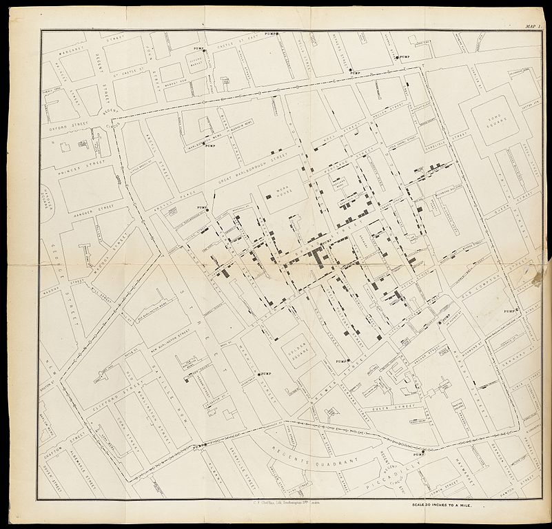

---
# Please do not edit this file directly; it is auto generated.
# Instead, please edit 00-intro.md in _episodes_rmd/
title: "Before we Start"
teaching: 10
exercises: 5
questions:
- "Why are we even visualizing?"
objectives:
- "Get to know the data we are going to work with"
keypoints:
- "This is not an introduction to R"
- "Visualisation is a useful way of representing data"
- "We are going to study diamonds!"

source: Rmd
---

## Why even visualise data?

Data can be complex. Data can be confusing. And a good visualisation of data
can reduce some of that complexity and confusion.

A good visualisation can reveal patterns in our data.

A really good visualisation can even provide insight that is difficult, or
impossible to find without.

A good example is this map, where the English physician John Snow plotted the 
deaths from Cholera in Soho, London from 19th august to 30th September
1854. 

The concentration of deaths indicated that the source of the disease was a 
common water pump. Removing the handle from the pump brought an end to the 
outbreak.

We are probably not going to discover patterns of equal importance in this course.

## The dataset we are working with

We are going to study a dataset containing information prices and other attributes
of 53940 diamonds:

~~~
head(diamonds)
~~~
{: .language-r}

~~~
# A tibble: 6 × 10
  carat cut       color clarity depth table price     x     y     z
  <dbl> <ord>     <ord> <ord>   <dbl> <dbl> <int> <dbl> <dbl> <dbl>
1  0.23 Ideal     E     SI2      61.5    55   326  3.95  3.98  2.43
2  0.21 Premium   E     SI1      59.8    61   326  3.89  3.84  2.31
3  0.23 Good      E     VS1      56.9    65   327  4.05  4.07  2.31
4  0.29 Premium   I     VS2      62.4    58   334  4.2   4.23  2.63
5  0.31 Good      J     SI2      63.3    58   335  4.34  4.35  2.75
6  0.24 Very Good J     VVS2     62.8    57   336  3.94  3.96  2.48
~~~
{: .output}

The dataset is included in the package ggplot2. 

| Variable | What is it? |
|----------|-------------|
| carat    | Weight of the diamond in carat (0.200 gram) |
| cut      | Quality of the cut of the diamond (Fair, Good, Very Good, Premium, Ideal) | 
| color    | Color of the diamon from D (best), to J (worst) |
| clarity  | How clear is the diamond. I1 (worst), SI2, SI1, VS2, VS1, VVS2, VVS1, IF (best) |
| depth    | Total depth percentage = z / mean(x, y) |
| table    | Width of the top of the diamond relative to its widest point |
| price    | Price in US dollars |
| x        | Length in mm | 
| y        | Width in mm |
| z        | depth in mm |


