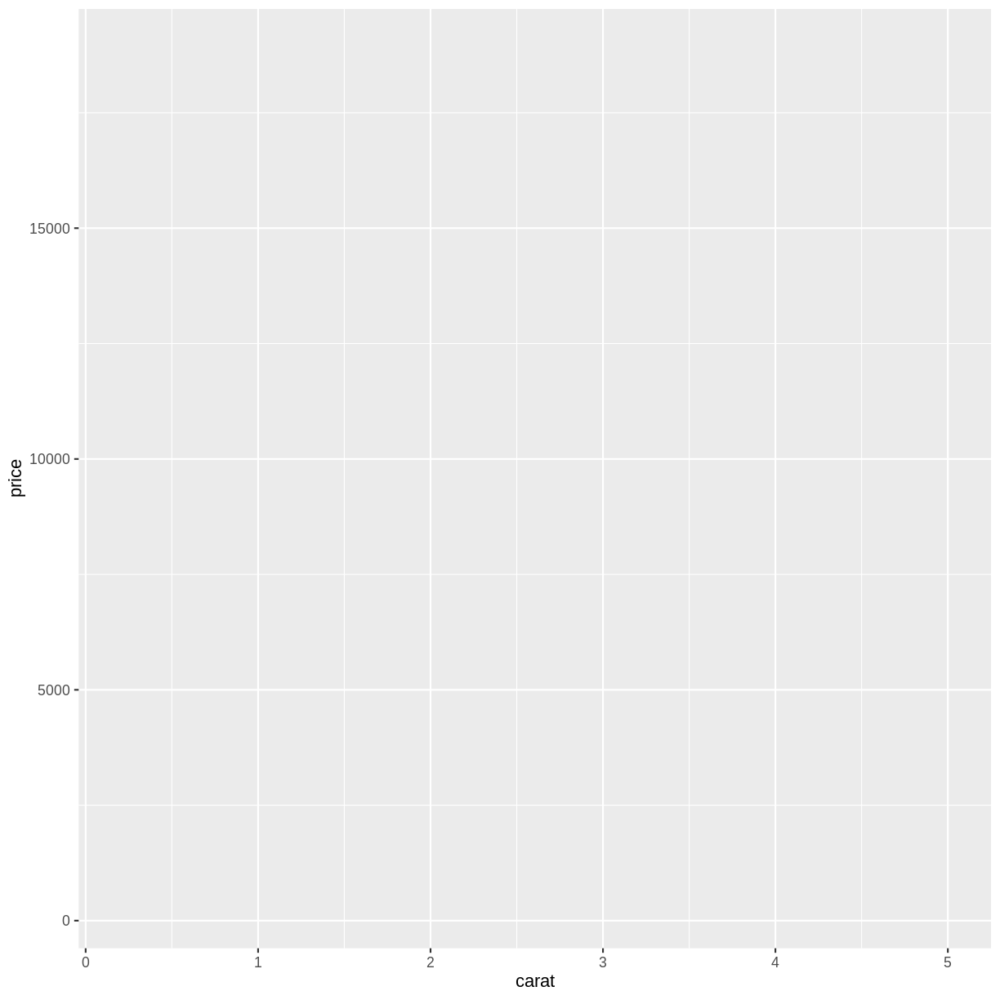
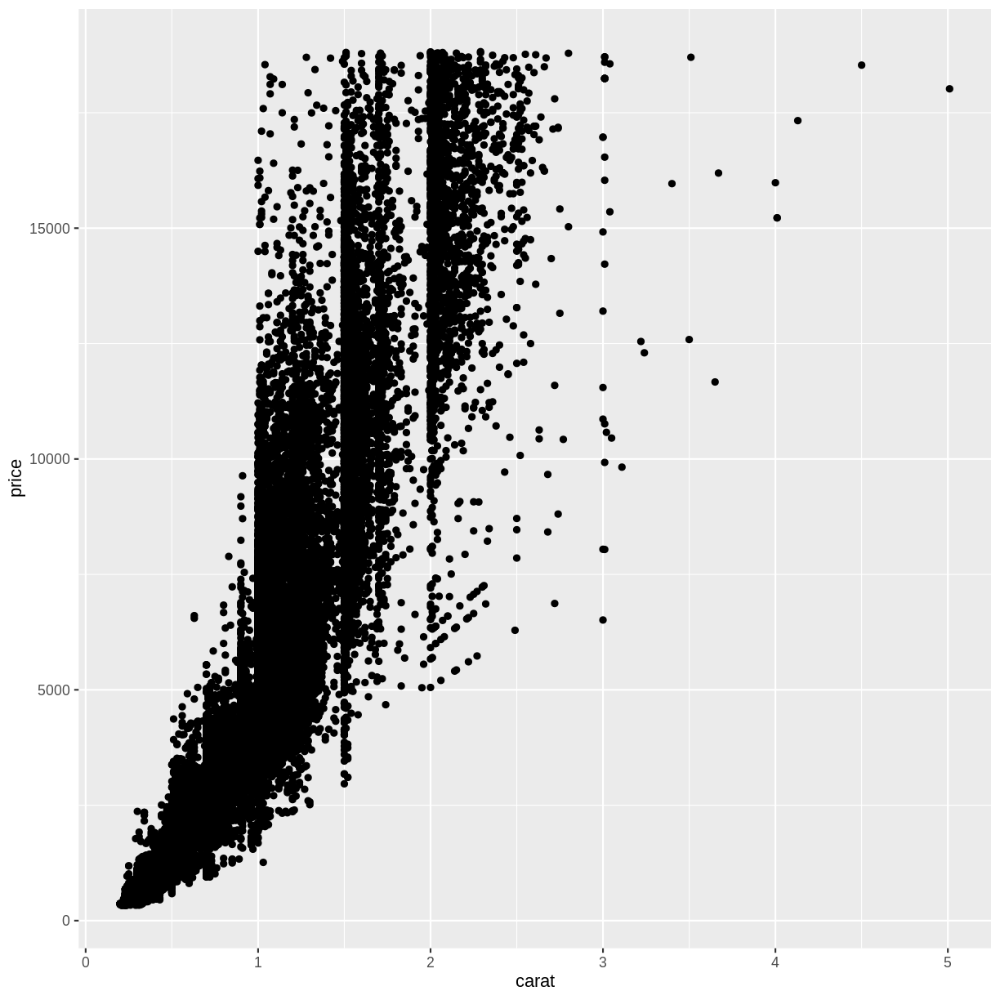

---
# Please do not edit this file directly; it is auto generated.
# Instead, please edit 01-getting-started.md in _episodes_rmd/
title: "Getting started"
teaching: 10
exercises: 5
questions:
- "How do we build a plot with ggplot2?"
objectives:
- "Get to understand the layers in ggplot2"
- "Make our first plot"
keypoints:
- "Plots in ggplot2 are build by adding layers"

source: Rmd
---

## The grammar of graphics

Plotting using ggplot2 is based on "[The Grammar of Graphics](https://link.springer.com/book/10.1007/0-387-28695-0)", a theoretical treatment of how 
to talk about and conceptualize plots by Leland Wilkinson.

That theoretical treatise has been implemented in the package ggplot2

We do not need to know or understand all details of this 620 page book. But some
weird naming conventions follows from this.

What we do need to know, is that based on the grammar of graphics, the layered
structure of a plot using ggplot, is build like this:

~~~
ggplot(data = <DATA>, mapping = aes(<MAPPINGS>)) + 
  <GEOM_FUNCTION>(
     mapping = aes(<MAPPINGS>),
     stat = <STAT>, 
     position = <POSITION>
  ) +
  <COORDINATE_FUNCTION> +
  <SCALE_FUNCTION> +
  <FACET_FUNCTION> +
  <THEME_FUNCTION>
~~~
{: .language-r}

The "<" and ">" indicates that we should supply something here. 

We are going to cover each element in the following.

> ## What is the difference?
>
> ggplot2 is the library, containing different types of 
> functions for plotting, theming the plots, changing colors
> and lots of other stuff.
>
> ggplot is one of these functions in ggplot2, and the one that 
> begins every plot we make.
>
> Yes it is confusing!
> 
{: .callout}

## ggplot in it self

The first thing we need to provide for ggplot is some `<DATA>`. We are working with
the diamond dataset:

~~~
ggplot(data = diamonds)
~~~
{: .language-r}

This in itself produces an extremely boring plot. But it is a plot, and actually
contains the data already. What is 
missing is information on what exactly it is in the dataset we are trying to plot.
How should our data be *mapped* to the area of our plot? Or, what should we 
have on the X-axis, and what should be on the Y-axis?

We provide that information to ggplot using the `<MAPPINGS>` argument to the 
ggplot function. Here we want to plot `carat` on the x-axis, and the `price`
on the y-axis:

~~~
ggplot(data = diamonds, mapping = aes(x = carat, y = price))
~~~
{: .language-r}

We are not actually seeing any data, because we have not specified the way the
individual datapoints should be plotted. But we do see that the axes now have values.
The data has influenced the plot!

We would like to make a classic scatter plot, and do that by adding the right
`<GEOM_FUNCTION>` to our plot. The `<GEOM_FUNCTION>` that do this, is called
`geom_points()`:

~~~
ggplot(data = diamonds, mapping = aes(x = carat, y = price)) +
  geom_point()
~~~
{: .language-r}

Comparing with the original template, we did not place any mapping in the 
`<GEOM_FUNCTION>` but rather in the first `ggplot()` function. 
The `<GEOM_FUNCTION>` will inherit the original mapping, if we do not provide
a specific mapping for it.

That means that:

~~~
ggplot(data = diamonds, mapping = aes(x = carat, y = price)) +
  geom_point()
~~~
{: .language-r}

and

~~~
ggplot(data = diamonds) +
  geom_point(mapping = aes(x = carat, y = price))
~~~
{: .language-r}

will yield the same result.

We can even provide the same mapping in both places. 

~~~
ggplot(data = diamonds, mapping = aes(x = carat, y = price)) +
  geom_point(mapping = aes(x = carat, y = price))
~~~
{: .language-r}

ggplot2 is a variation on the original grammar of graphics, called *layered grammar
of graphics*, where the individual parts of the plot are added as layers, one
on top of another. The **+** sign adds these layers.

> ## geoms
>
> geom_point() is the function we use to make scatter plots; because points is
> a geometric object. 
> Other geometric objects can be plotted:
> geom_histogram() will plot histograms
> geom_line() will plot lines
>
> All geometries in ggplot2 are named using the pattern geom_
> 
{: .callout}

## The plus sign

The use of the **+** sign allows us to break up the code producing the plot
in multiple lines. This makes it easier to read (and write!) the code producing
the plot. 

Note that the correct placement of **+** and linebreaks are very important.

This code will work:

~~~
ggplot() +
  geom_point()
~~~
{: .language-r}

This will not add the new layer and will return an error message:

~~~
ggplot()
  + geom_point()
~~~
{: .language-r}

> ## Exercise
> 
> Plot "carat" (the weight of the diamond) against "x" (the length of the diamond).
> Make it a scatterplot
> 
> > ## Solution
> >
> > diamonds %>%
> >   ggplot(aes(carat, x)) +
> >   geom_point()
> > Note that some outliers, probably erroneous data, are discovered. 
> > A length of 0 is highly suspicious. Plots are also useful to reveal this 
> > sort of things!
> {: .solution}
{: .challenge}


