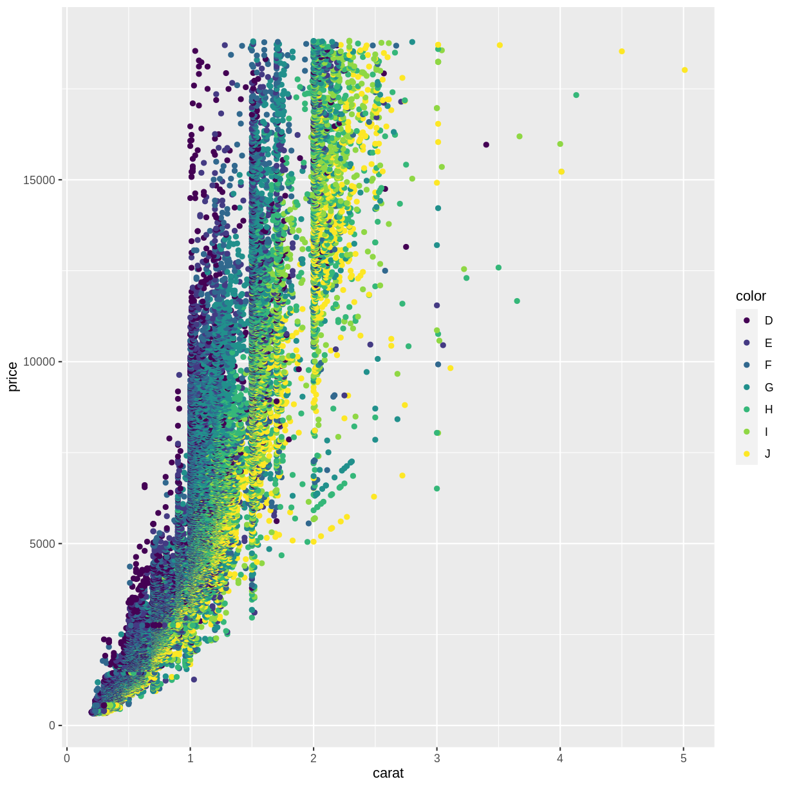
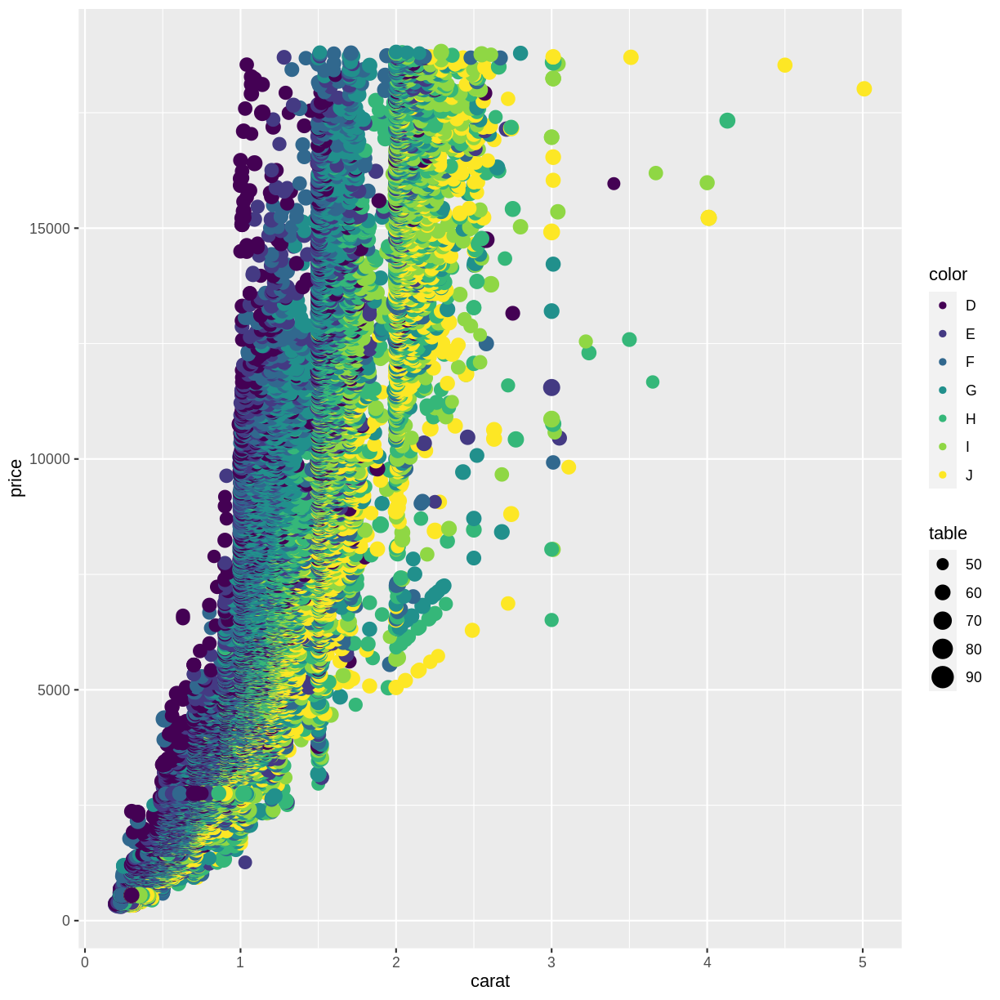
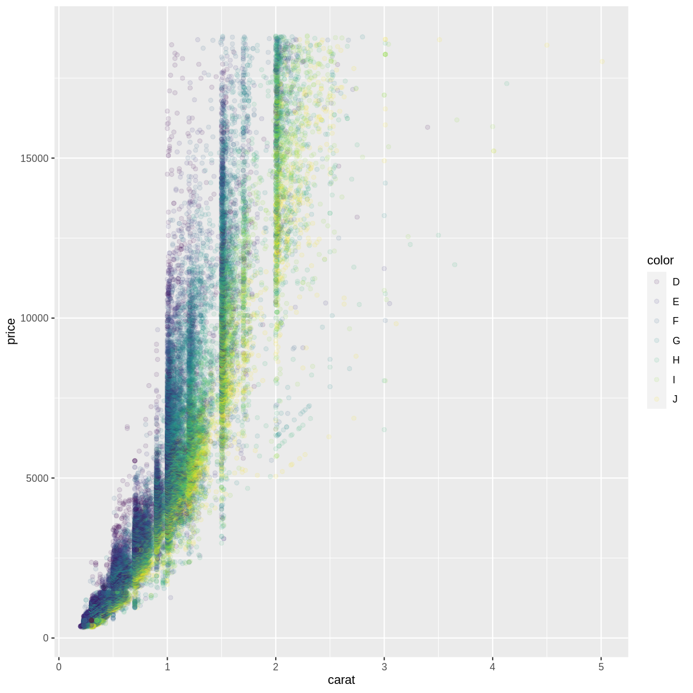

---
# Please do not edit this file directly; it is auto generated.
# Instead, please edit 015-further-mapping.md in _episodes_rmd/
title: "Further mapping"
teaching: 10
exercises: 5
questions:
- "FIX ME"
objectives:
- "FIX ME"
keypoints:
- "FIX ME"

source: Rmd
---

We saw how to map data to a position in a scatterplot. But we are able to map 
the data to other elements of a plot, eg the color of the points.

TRÆLS: color = color. Sådan er det bare.

~~~
ggplot(data = diamonds, mapping = aes(x = carat, y = price, color = color)) +
  geom_point()
~~~
{: .language-r}

Not surprisingly, the "best" color, D have higher prices than the "worst"
color, "J".

A common mistake is to place the color argument a wrong place:

~~~
ggplot(data = diamonds, mapping = aes(x = carat, y = price), color = color) +
  geom_point()
~~~
{: .language-r}

What happened to the color? The color argument is outside the aes() function.
That means that we are not mapping data to the color!

What else can we map data to?

~~~
ggplot(data = diamonds, mapping = aes(x = carat, y = price, color = color, size = table)) +
  geom_point()
~~~
{: .language-r}

Not at good plot...

What can be mapped to the plot depends on the geom we are using. 

Calling the help function, ?geom_point, on a geom will provide insight on that
question. Doing it on the geom_poin() function, reveals that x and y are mandatory
because they are in bold.

## not actually mapping
Rather than mapping values from the data to an aesthetic, we can provide
values directly. One very useful aesthetic to play with, at least when
we have as many datapoints as we have here, is `alpha`:

~~~
ggplot(data = diamonds, mapping = aes(x = carat, y = price, color = color)) +
  geom_point(alpha = 0.1)
~~~
{: .language-r}

`alpha´ controls the transparency of the points plotted, and is a handy way of
handling overplotting, the phenomenon that multiple data points might be 
identical. 

Note:

### This is the correct syntax for adding layers

~~~
ggplot() +
  geom_point()
~~~
{: .language-r}

### This will not add the new layer and will return an error message

~~~
ggplot()
  + geom_point()
~~~
{: .language-r}


