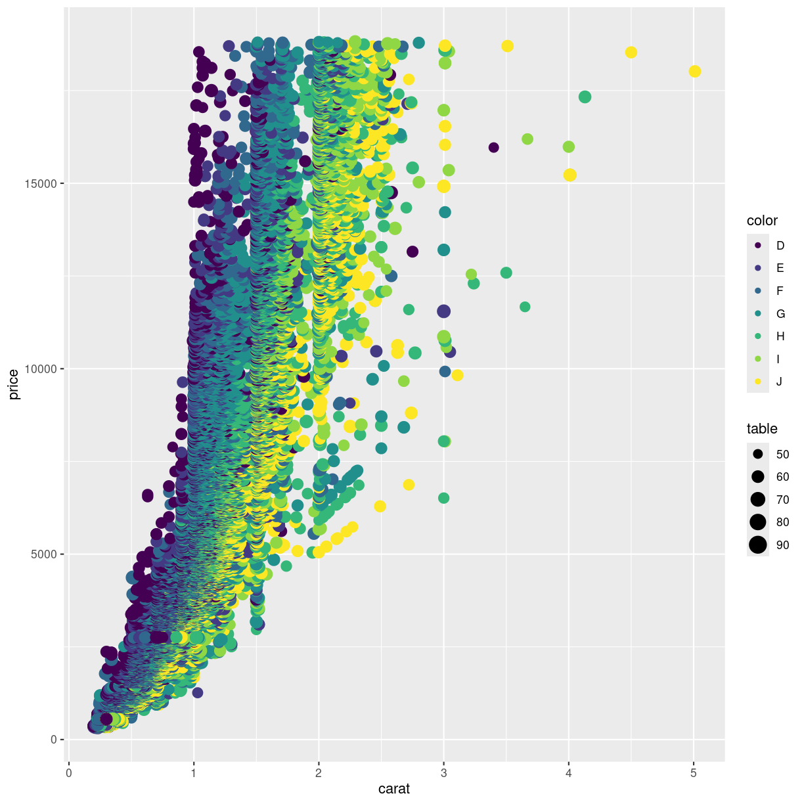

---
# Please do not edit this file directly; it is auto generated.
# Instead, please edit 02-different-plots.md in _episodes_rmd/
title: "Different types of plots"
teaching: 10
exercises: 5
questions:
- "FIX ME"
objectives:
- "FIX ME"
keypoints:
- "FIX ME"

source: Rmd
---

Hvilke andre typer plots kan vi lave?

Et af dem bør have "se selv på aesthetics i hjælp, og tilpas". det kunne nok godt 
være violinplot efter vi har kigget på boxplots

## Histogrammer

~~~
diamonds %>% 
  ggplot(aes(carat)) +
  geom_histogram()
~~~
{: .language-r}

~~~
`stat_bin()` using `bins = 30`. Pick better value with `binwidth`.
~~~
{: .output}

## Søjlediagrammer

~~~
ggplot() +
  geom_col()
~~~
{: .language-r}

## boxplots

~~~
diamonds %>% ggplot(aes(carat, y = cut)) +
  geom_boxplot()
~~~
{: .language-r}

## Violinplots

~~~
diamonds %>% ggplot(aes(carat, y = cut)) +
  geom_violin()
~~~
{: .language-r}

## og mange andre

ggplot2 is born with a multitude of different plots. And ggplot2 can be 
extended. 

A complete list of plots will be very long, and take up all the time for this
course.

Take a look at https://r-graph-gallery.com/

or at https://kubdatalab.github.io/R-graphs/ (NB a work in progress), where
we will collect weird and wonderful plots, when to use them, when not to 
use them. And how to make them.


