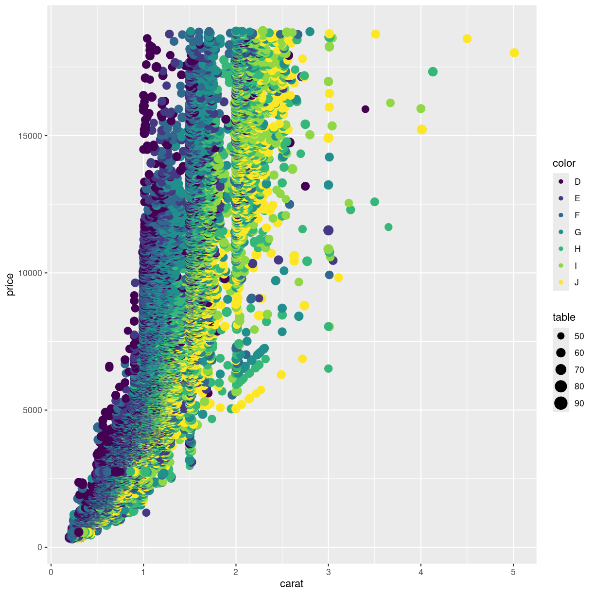

---
# Please do not edit this file directly; it is auto generated.
# Instead, please edit 02-further-mapping.md in _episodes_rmd/
title: "Further mapping"
teaching: 10
exercises: 5
questions:
- "Can we map data to other parts of the plot"
objectives:
- "FIX ME"
keypoints:
- "FIX ME"

source: Rmd
---

We saw how to map data to a position in a scatterplot. But we are able to map 
the data to other elements of a plot, eg the color of the points.

TRÆLS: color = color. Sådan er det bare.

~~~
ggplot(data = diamonds, mapping = aes(x = carat, y = price, color = color)) +
  geom_point() +
  scale_color_brewer(palette = "Dark2")
~~~
{: .language-r}

Overvej den sidste linie - farveblindhed - hm. Nødvendigt?
Not surprisingly, the "best" color, D have higher prices than the "worst"
color, "J".

A common mistake is to place the color argument a wrong place:

~~~
ggplot(data = diamonds, mapping = aes(x = carat, y = price), color = color) +
  geom_point()
~~~
{: .language-r}

What happened to the color? The color argument is outside the aes() function.
That means that we are not mapping data to the color!

What else can we map data to?

~~~
ggplot(data = diamonds, mapping = aes(x = carat, y = price, color = color, size = table)) +
  geom_point()
~~~
{: .language-r}

Not at good plot... We need to think about the combination of stuff we want to
plot. Often two plots are better than trying to cram everything into a single plot.

What can be mapped to the plot depends on the geom we are using. 

Calling the help function, `?geom_point`, on a geom will provide insight on that
question. Doing it on the geom_point() function, reveals that x and y are mandatory
because they are in bold.

The list of stuff we can map data to in geom_point:

* *x*
* *y*
* alpha
* colour
* fill
* group
* shape
* size
* stroke

Different geom_ functions have different mandatory/required aesthetics.

## Not really mapping. Sorta.
Rather than mapping values from the data to an aesthetic, we can provide
values directly. One very useful aesthetic to play with, at least when
we have as many datapoints as we have here, is `alpha`:

~~~
ggplot(data = diamonds, mapping = aes(x = carat, y = price, color = color)) +
  geom_point(alpha = 0.1)
~~~
{: .language-r}

`alpha´ controls the transparency of the points plotted, and is a handy way of
handling overplotting, the phenomenon that multiple data points might be 
identical. 

> ## geoms
>
> geom_point() is the function we use to make scatter plots; because points is
> a geometric object. 
> Other geometric objects can be plotted:
> geom_histogram() will plot histograms
> geom_line() will plot lines
> 
>
> All geometries in ggplot2 are named using the pattern geom_
> 
{: .callout}

r ggpubr::show_point_shapes()


