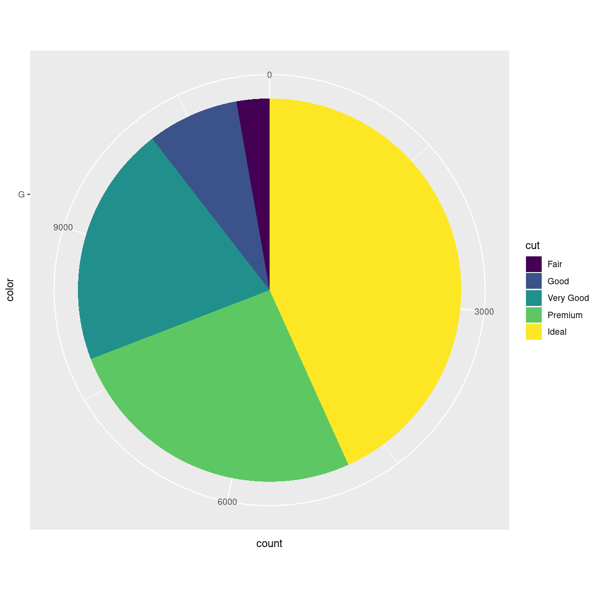

---
# Please do not edit this file directly; it is auto generated.
# Instead, please edit 025-scaling-and-coordinates.md in _episodes_rmd/
title: "Scaling and coordinates"
teaching: 10
exercises: 5
questions:
- "FIX ME"
objectives:
- "FIX ME"
keypoints:
- "FIX ME"

source: Rmd
---

The coordinate system can be changed. If we want to flip the coordinates, we
could interchange the x and y values in the mapping argument.
Or we could add a coordinate function that changes the coordinate system:

~~~
ggplot(data = diamonds, mapping = aes(x = carat, y = price, color = color)) +
  geom_point() +
  coord_flip()
~~~
{: .language-r}

Other coord_ functions exists, the most commonly used are coord_flip and coord_polar:

~~~
ggplot(data = diamonds, mapping = aes(x = carat, y = price, color = color)) +
  geom_point() +
  coord_polar()
~~~
{: .language-r}

That might not be that useful working with diamonds.


