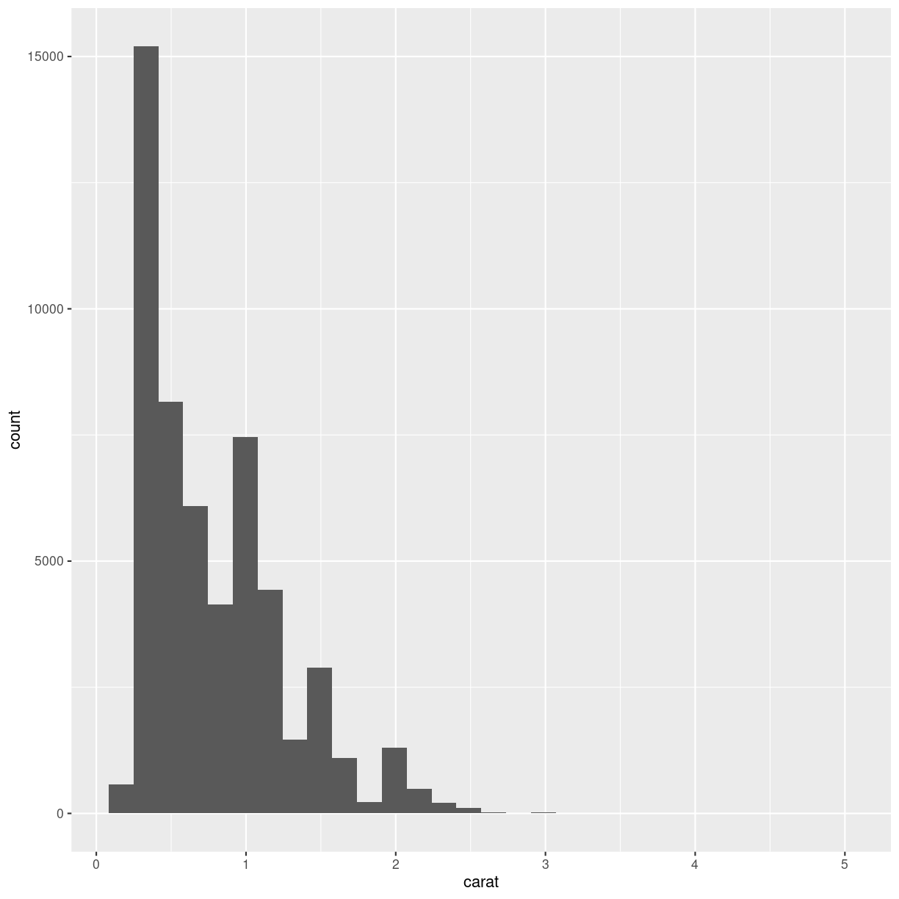
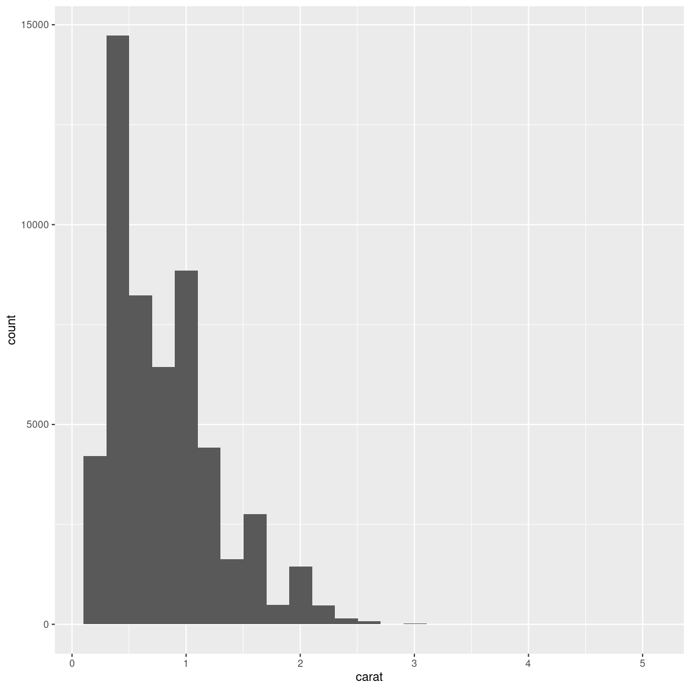
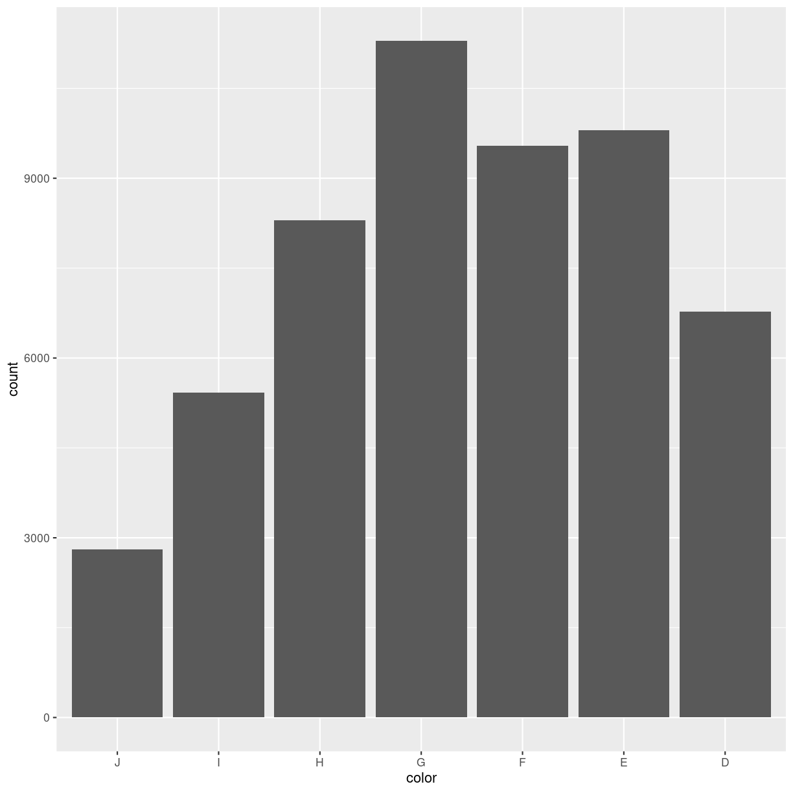

---
# Please do not edit this file directly; it is auto generated.
# Instead, please edit 03-different-plots.md in _episodes_rmd/
title: "Different types of plots"
teaching: 10
exercises: 5
questions:
- "What other types of plots can we make?"
objectives:
- "FIX ME"
keypoints:
- "FIX ME"

source: Rmd
---

# A collection of different types of plots

Scatterplots are very useful, but we often need other types of plots. In this part of the course, we are going to look at some of the more
common types.

## Histograms

Histograms splits all observations of a variable up in a number of
"bins". It counts how many observations are in each bin. Then we plot a column
with a height equivalent to the number of observations for each bin:

~~~
diamonds %>% 
  ggplot(aes(carat)) +
  geom_histogram()
~~~
{: .language-r}

~~~
`stat_bin()` using `bins = 30`. Pick better value with `binwidth`.
~~~
{: .output}

Note that we get a warning from `geom_histogram` that the number of 
bins by default is set to 30. 30 bins will almost never be the correct
number of bins, and we should chose a better value ourself.

~~~
diamonds %>% 
  ggplot(aes(carat)) +
  geom_histogram(bins = 25)
~~~
{: .language-r}

General rules for choosing the correct number of bins exists. We recommend that you experiment with different number of bins to find the
one you like best.

## Barcharts

Not to be confused with histograms, barcharts count the number of 
observations in different groups. Where the scale in histograms is 
continuous, and split into bins, the scale in barcharts is discrete. 

Here we map the color-variable to the x-axis in the barchart. `geom_bar` counts the number of observations itself - we do not need to
provide a count:

~~~
diamonds %>% 
  ggplot(aes(color)) +
  geom_bar()
~~~
{: .language-r}

## boxplots

Boxplots are suitable for visualising the distribution of data. 
We can make a boxplot of a single variable in the data - or we 
can make several boxplots in one plot:

~~~
diamonds %>% ggplot(aes(x = carat, y = cut)) +
  geom_boxplot()
~~~
{: .language-r}

Here we have the variable we are making boxplots of, on the x-axis,
and splitting them up in one plot per cut, on the y-axis.

## Violinplots

Boxplots are not necessarily the best option for showing distributions.
A good alternative could be violinplots:

> ## exercise
> The geom_ for making violin plots is `geom_violin`
> Look at the help for `geom_violin` and make a violinplot
> with carat on the x-axis, and cut on the y-axis.
> > ## Solution
> >
> > diamonds %>% ggplot(aes(carat, y = cut)) +
> >   geom_violin()
> >
> {: .solution}
{: .challenge}

## And many more

ggplot2 is born with a multitude of different plots. And ggplot2 can be
extended. 

A complete list of plots will be very long, and take up all the time for this course.

Take a look at https://r-graph-gallery.com/

or at https://kubdatalab.github.io/R-graphs/ (NB a work in progress), where we will collect weird and wonderful plots, when to use them, when not to 
use them. And how to make them.


