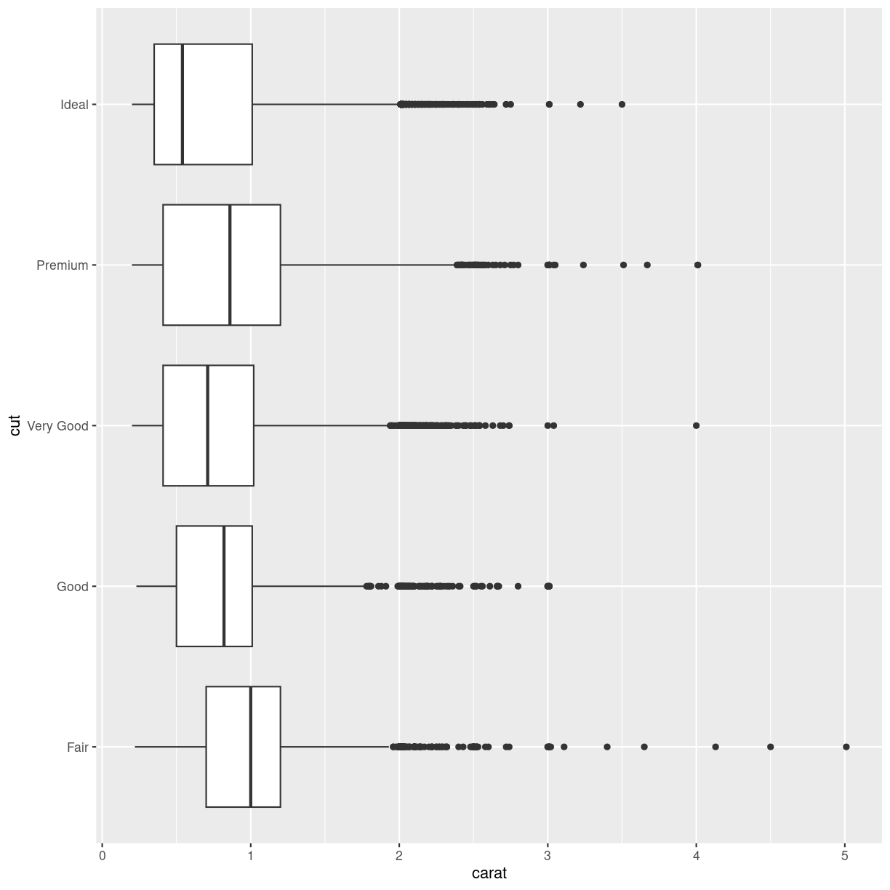

---
# Please do not edit this file directly; it is auto generated.
# Instead, please edit 04-order.md in _episodes_rmd/
title: "Ordering stuff"
teaching: 10
exercises: 5
questions:
- "FIX ME"
objectives:
- "FIX ME"
keypoints:
- "FIX ME"

source: Rmd
---

# The order of stuff

Previously we made a boxbplot:

~~~
diamonds %>% ggplot(aes(carat, y = cut)) +
  geom_boxplot()
~~~
{: .language-r}

Knowing what we know about the order of terms for the quality of the diamonds,
this makes sense. Fair is the lowest quality of the cut, ideal the best.

But what is determining the order in this plot?

## One introductory element in R

Factors

One concept that we do not cover in our introductory courses is *factors*.

Factors are the R way of handling categorical variables. Categorical variables,
also known as qualitative variables, are variabels that can take on one and only
one, of a limited, usually fixed, number of possible values. 

Classical examples are the roll of a six-sided die, that can only have one of the
possible outcomes of 1, 2, 3, 4, 5 or 6. The role in reproduction for a mammal
can be only female or male. Either your cell phone has power. Or it dont.

These are examples of intrinsic categorical values. 

We might also discretize continous variables, like how much battery is left on a 
cell phone. The actual value might be 55%. But we are recording only levels of 
0%, 25%, 50%, 75% and 100%. And in that case we will probably record the categorical
value as 50%.

With the data we are working with here, the cut of a diamond can be either
Fair, Good, Very Good, Premium and Ideal. 

These are categorical values. The cut of a diamond is either Fair or not-Fair.

Let us take a look at the actual values of the cut variable (of the first 6 
observations) in our dataset:

~~~
head(diamonds$cut)
~~~
{: .language-r}

~~~
[1] Ideal     Premium   Good      Premium   Good      Very Good
Levels: Fair < Good < Very Good < Premium < Ideal
~~~
{: .output}
We see the values. And we also see that these values have *levels*, the six
categorical values that the cut of a diamond can have.

If we try to convert the values of the cut to numerical values, we can see how 
these values are actually stored by R:

~~~
as.numeric(head(diamonds$cut))
~~~
{: .language-r}

~~~
[1] 5 4 2 4 2 3
~~~
{: .output}
R handles categorical values, factors, by assigning an integer to each value.
5 to "ideal", 4 to "Premium", 2 to "Good" etc. These are the values stored.

Associated with these values are *levels*

~~~
levels(diamonds$cut)
~~~
{: .language-r}

~~~
[1] "Fair"      "Good"      "Very Good" "Premium"   "Ideal"    
~~~
{: .output}

And they appear in a specific order. 

The cut of diamonds are actually not only categorical, but also *ordinal*, meaning
that they are not just in a specific order, but that one level is "better" than
another. We see an indication here:

~~~
head(diamonds$cut)
~~~
{: .language-r}

~~~
[1] Ideal     Premium   Good      Premium   Good      Very Good
Levels: Fair < Good < Very Good < Premium < Ideal
~~~
{: .output}
Where the "<" indicates that "Good" is better than "Fair", but worse than 
"Very good".

We can change the order of the levels of a factor using functions from the 
*forcats* library:

~~~
fct_relevel(diamonds$cut, "Good", "Ideal") %>% 
  head()
~~~
{: .language-r}

~~~
[1] Ideal     Premium   Good      Premium   Good      Very Good
Levels: Good < Ideal < Fair < Very Good < Premium
~~~
{: .output}
Now the order is changed, because we have specified that the first two levels 
should be "Good", followed by "Ideal".

The forcats library have many other functions for working with factors. 

Regarding plotting in R, the important thing to know is that the order of things
in our plots are typically controlled by the order of factors, and that we can
change that order to suit our needs.


