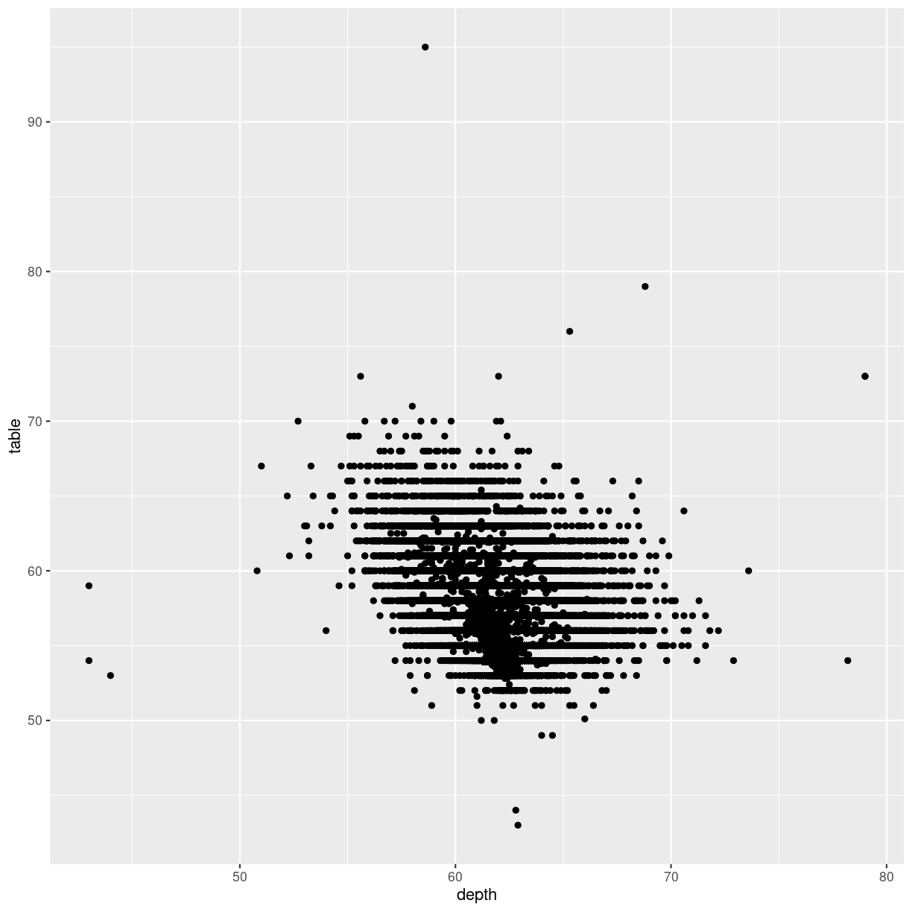
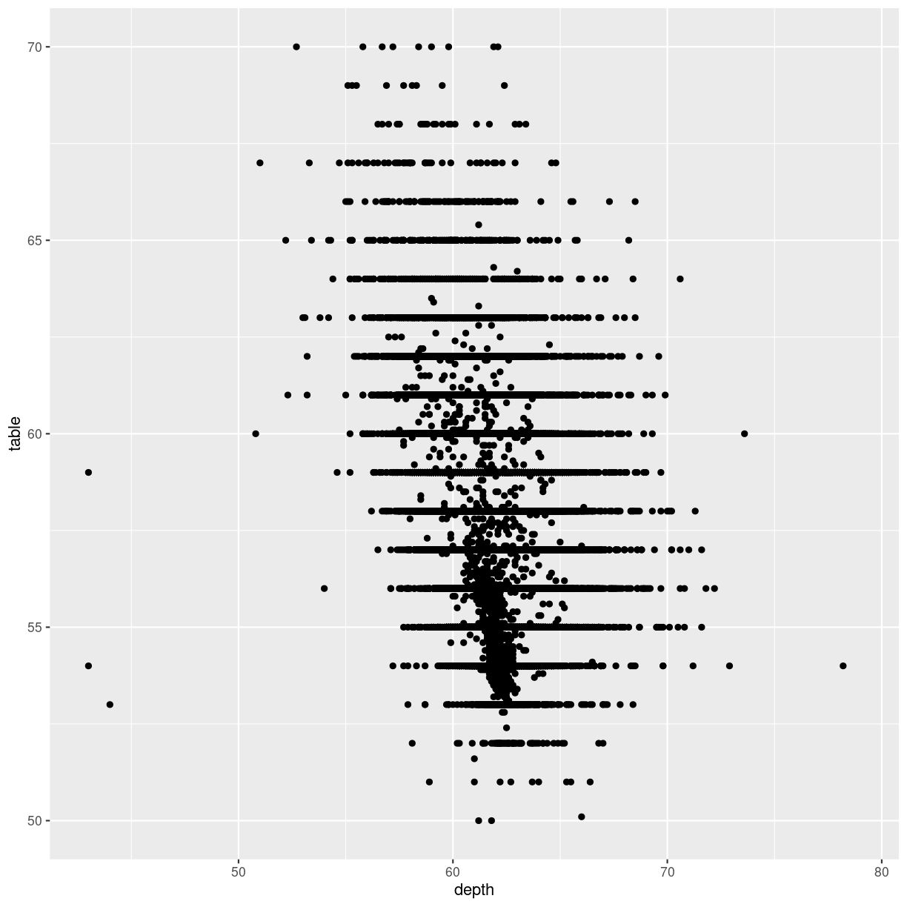
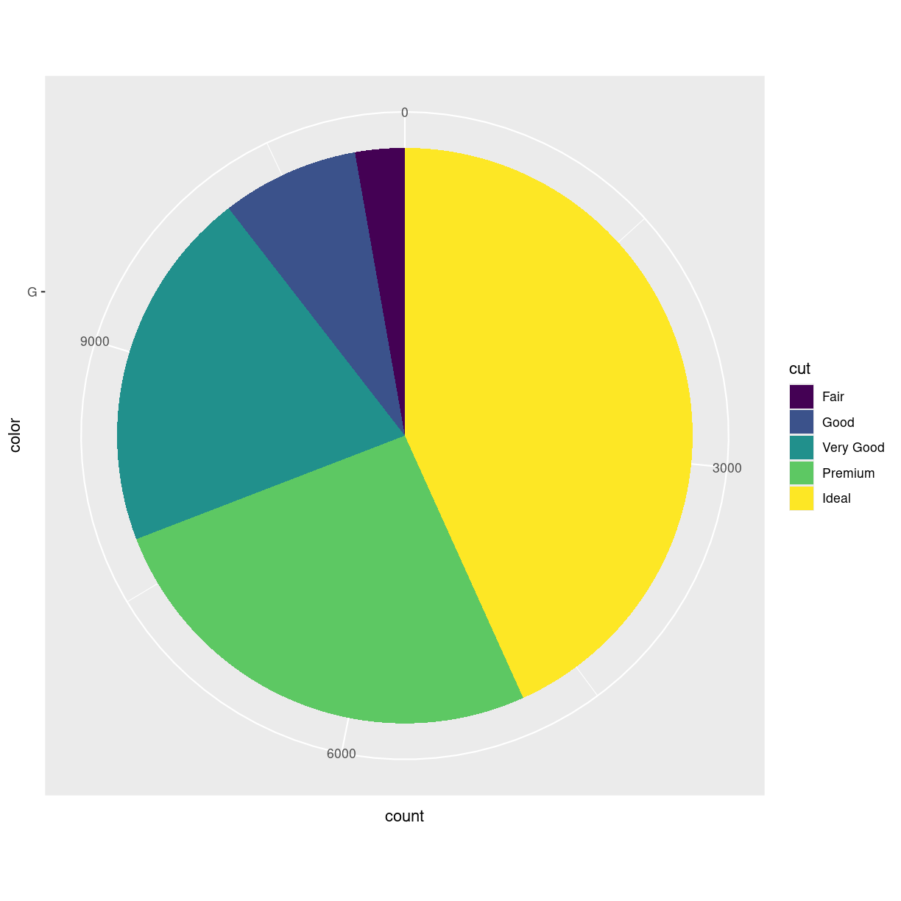
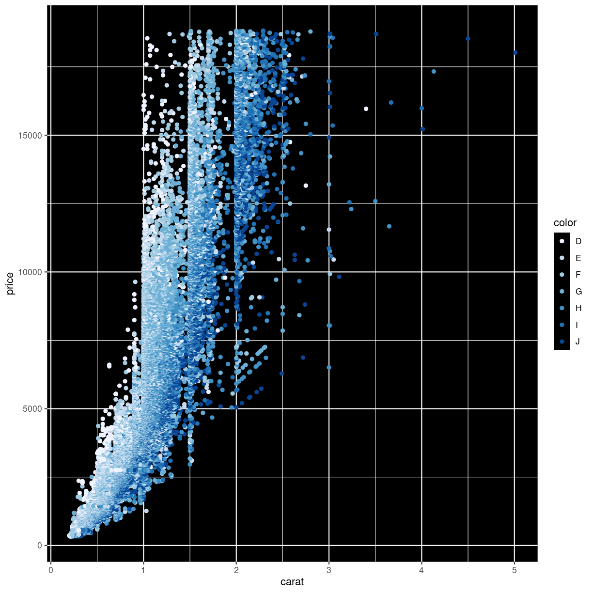
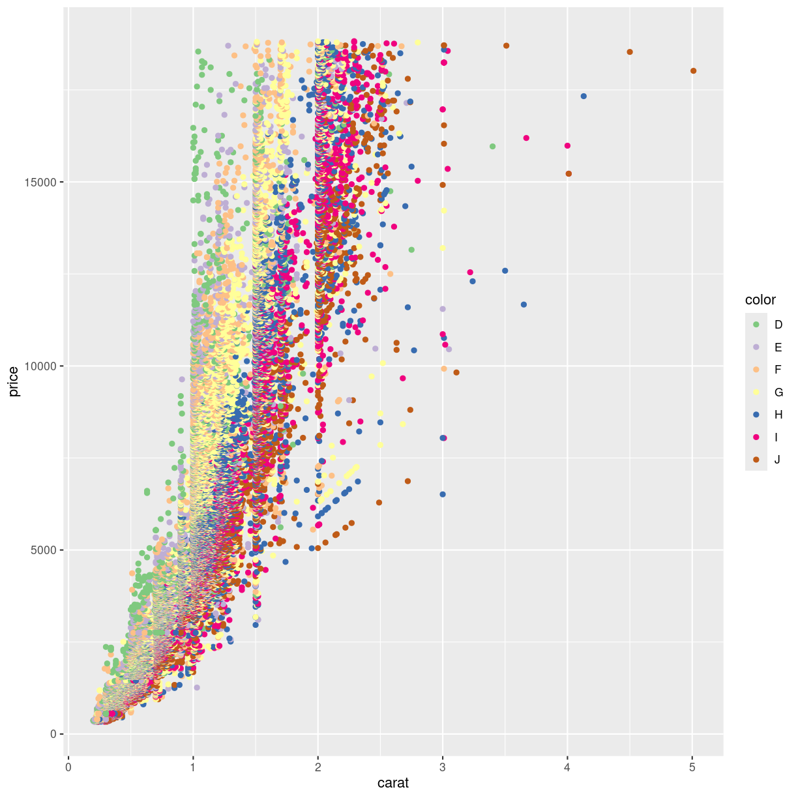

---
# Please do not edit this file directly; it is auto generated.
# Instead, please edit 05-scaling-and-coordinates.md in _episodes_rmd/
title: "Scaling and coordinates"
teaching: 10
exercises: 5
questions:
- "FIX ME"
objectives:
- "FIX ME"
keypoints:
- "FIX ME"

source: Rmd
---

## Changing scale and coordinates

ggplot choses a coordinate system for us. Like bins in 
histograms, that coordinate system might not be the right for
our data.

One of the more commonly cited "rules" for plots and graphs is
that the coordinate system should begin at zero. And ggplot
does not necessarily give us a coordinate system that begins at zero. So how do we force it to?

~~~
diamonds %>% 
  ggplot(aes(depth, table)) +
  geom_point()
~~~
{: .language-r}

We can control the axes precisely by adding xlim and/or ylim
to the plot. We need to provide these functions with a 
vector of length 2, indicating the minimum and maximum values
we want:

~~~
diamonds %>% 
  ggplot(aes(depth, table)) +
  geom_point() +
  xlim(c(0,80)) +
  ylim(c(0,100))
~~~
{: .language-r}

It is nice to be able to control the two axes seperately. 
Because the coordinate system should not always begin at zero.
Especially time-series, showing a development over time, 
should often *not* begin at zero. 

### Zooming

Let us zoom in on the plot above, and look at tables between
50 and 70, by adjusting the ylim:

~~~
diamonds %>% 
  ggplot(aes(depth, table)) +
  geom_point() +
  ylim(c(50,70))
~~~
{: .language-r}

~~~
Warning: Removed 12 rows containing missing values (`geom_point()`).
~~~
{: .warning}

That returns a warning! Some data is not within the limits we
placed on the y-axis. This might not be a problem. Or it might.

If we are doing more advanced stuff like scaling the axes (eg. logarithmically), cutting of data might be a bad idea.

Zooming in on particular areas of the plot is done better 
using the `coord_cartesian` function:

~~~
diamonds %>% 
  ggplot(aes(depth, table)) +
  geom_point() +
  coord_cartesian(ylim = c(50,70))
~~~
{: .language-r}

This will not cut out data from the plot, they are still there
for other geoms that might need them, they are simply not
plotted.

### Why would that be a problem?

That would be a problem, because the `ylim` approach removes data before the 
plot is actually made. Functions that would use these removed data will no
longer have access to them. Let us show - without going deep into what is 
actually happening, the difference.

We can add a smoothing function to a plot, that adds a trendline to the data.
This smoother is based on all the data available to it. Let us make two plots,
one where we zoom using `ylim`, and one where we zoom using `coord_cartesian`:

~~~
library(patchwork)
p1 <- diamonds %>% 
  ggplot(aes(depth, table)) +
  geom_point() +
  ylim(c(50,70)) +
  geom_smooth() +
  ggtitle("Zoom by ylim", subtitle = "Smooth only uses a subset of data")

p2 <- diamonds %>% 
  ggplot(aes(depth, table)) +
  geom_point() +
  coord_cartesian(ylim = c(50,70)) +
  geom_smooth() +
  ggtitle("Zoom by coord_cartesian", subtitle = "Smooth uses all data") 

print(p1 + p2)
~~~
{: .language-r}

~~~
`geom_smooth()` using method = 'gam' and formula = 'y ~ s(x, bs = "cs")'
~~~
{: .output}

~~~
Warning: Removed 12 rows containing non-finite values (`stat_smooth()`).
~~~
{: .warning}

~~~
Warning: Removed 12 rows containing missing values (`geom_point()`).
~~~
{: .warning}

~~~
`geom_smooth()` using method = 'gam' and formula = 'y ~ s(x, bs = "cs")'
~~~
{: .output}

The trendlines are very different, because the data they are based on is
different.

## Changing the coordinate system

We saw above that we could adjust the coordinate system in order
to zoom in on specific parts of the plot. We can do other things
with the coordinate system!

Should we want to flip the coordinates, we
could interchange the x and y values in the mapping argument.
Or we could add a coordinate function that changes the coordinate system:

~~~
ggplot(data = diamonds, mapping = aes(x = carat, y = price, color = color)) +
  geom_point() +
  coord_flip()
~~~
{: .language-r}

Other coord_ functions exists eg coord_polar, that allows us 
to plot polar coordinates. And what might we use that for?

A very popular plot type is pie charts. Pie charts in ggplot
can be defined by making a stacked bar-chart, and changing the
coordinate system to polar.

We begin by filtering the data set to only include diamonds
with the color "G", and then make a barchart. We add the 
argument `position = "stack"` to `geom_bar` to stack the bars
rather than having them side by side. And then we adjust
the coordinate system to be polar (the y-axis specifically), 
beginning at 0:

~~~
diamonds %>% 
  mutate(color = as.character(color)) %>% 
  filter(color == "G") %>% 
  ggplot(aes(x= color, fill = cut)) +
  geom_bar(position = "stack") +
  coord_polar("y", start=0) 
~~~
{: .language-r}

> ## What are polar coordinates?
>
> Our ordinary coordinate system is a cartesian coordinate system. 
> Each point in the system are defined by two values, X and Y, representing 
> the distance from the origin or reference point of the coordinate system.
> 
> In a polar coordinate system, each point in the plane is defined by two values: 
> radius (r) and angle (θ). The radius represents the distance from a reference 
> point (called the pole) to the point in question, and the angle is the angle 
> formed between the positive x-axis (in ggplot2, this is usually the horizontal
> axis) and the line connecting the pole to the point.
>
> In a polar coordinate system, we still have a point of origin, 0,0
> but now the points are plottet using an angle from the x-axis and a 
> distance 
> 
{: .callout}

> ## Why does geom_pie not exist?
> 
> 
>
{: .caution}

~~~
ggplot(data = diamonds, mapping = aes(x = carat, y = price, color = color)) +
  geom_point() +
  coord_polar()
~~~
{: .language-r}

That might not be that useful working with diamonds.

## Log -scale

TÆNK LIDT OVER DEN... forklaring. Hvorfor logaritmerer vi. 
Måske bedre eksempel end herunder.

~~~
diamonds %>% 
  ggplot(aes(carat, price)) +
  geom_point() +
  scale_y_log10()
~~~
{: .language-r}


