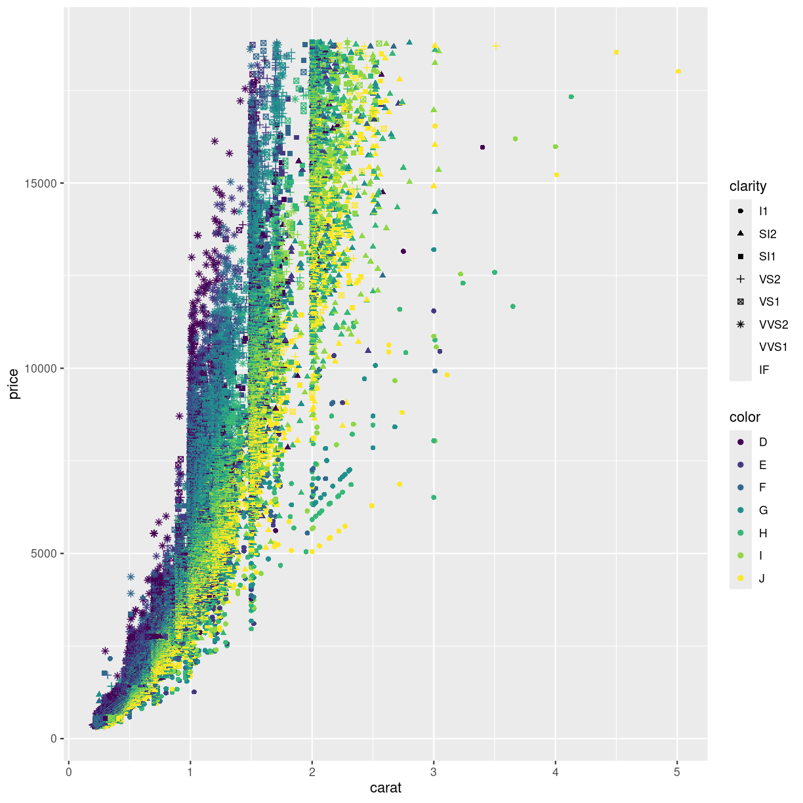

---
# Please do not edit this file directly; it is auto generated.
# Instead, please edit 06-facets.md in _episodes_rmd/
title: "Facetting"
teaching: 10
exercises: 5
questions:
- "FIX ME"
objectives:
- "FIX ME"
keypoints:
- "FIX ME"

source: Rmd
---

### FACET_FUNCTION

There are more variables in this dataset. But it becomes increasingly difficult
to add information to a two dimensional plot. One way to overcome this might be to 
make more than one plot, based on values in the dataset.

This is called facetting:

~~~
ggplot(data = diamonds, mapping = aes(x = carat, y = price, color = color)) +
  geom_point() +
  facet_wrap(~clarity)
~~~
{: .language-r}

~~~
ggplot(data = diamonds, mapping = aes(x = carat, y = price, color = color)) +
  geom_point() +
  facet_grid(clarity ~ color)
~~~
{: .language-r}


