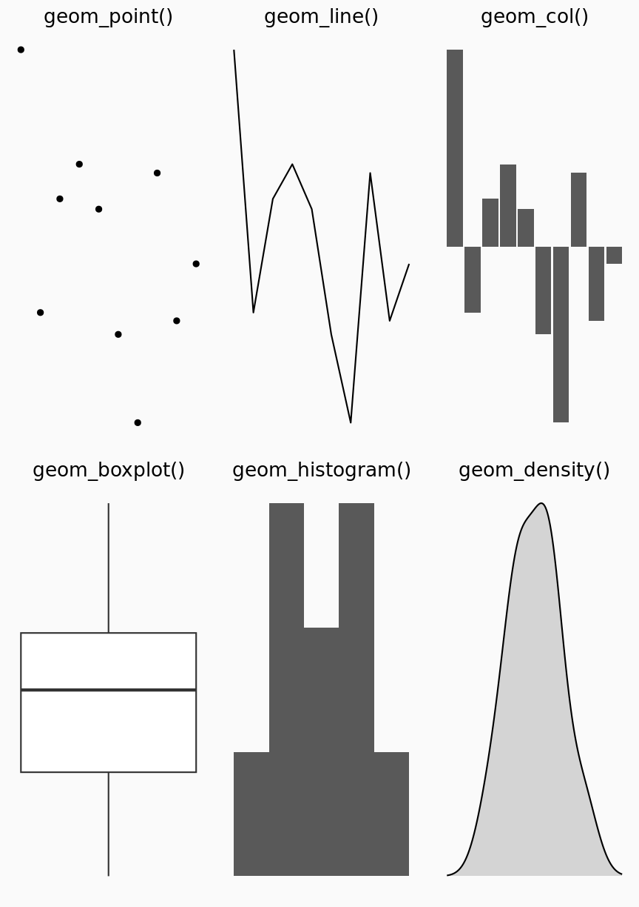

---
# Please do not edit this file directly; it is auto generated.
# Instead, please edit 06-theming.md in _episodes_rmd/
title: "Theming"
teaching: 10
exercises: 5
questions:
- "FIX ME"
objectives:
- "FIX ME"
keypoints:
- "FIX ME"

source: Rmd
---

### THEME_FUNCTION

The structure of plots generated by ggplot2 allows us to change plot type from eg. barplot to scatterplots with only minimal changes. 

og hvis vi ændrer på det underliggende data.

ggplot2 is the package. The funcion is called ggplot(). 

https://pkg.garrickadenbuie.com/gentle-ggplot2/#153

ggplot2 works best with data in a socalled long format, ie one column for 
each (and every) variable, and a row for every observation.

It is highly recommended to structure data in this way.

How are visuals expressed in words?

Data - to be visualised

Geometric objects that appear on the plot

Aesthetic mappings from data to component in graph

Statistics - transforming data on its way to the graph

Coordinates - that organises the location of geometric objects

Scales - defining the range of values for aesthetics

Facets - grouping data into subplots.

Data:
ggplot(data)

Tidy data:
Each variable forms a column

Each observation forms a row

Each observational unit forms a table

Begin by asking:

What information do I want to use in my 
visualisation

Is that data contained in one column/row
for a given data point?

Måske et eksempel.

Aesthetics + aes()

Vis hvad der mappes til hvad i et gennemgående eksempel. 
year -> x
pop -> y
country -> farve, form noget

videre til:
aes(x = year,
    y = pop,
    color = country)
    
    
+ geom_*() - der er et fint plot #36

Denn figur taget ret direkte. Det er heller
ikke givet at det er den jeg er har lyst til at vise.

~~~
Warning: `data_frame()` was deprecated in tibble 1.1.0.
Please use `tibble()` instead.
~~~
{: .warning}

~~~
Warning in grid.Call(C_stringMetric, as.graphicsAnnot(x$label)): font family
'Fira Mono' not found in PostScript font database
Warning in grid.Call(C_stringMetric, as.graphicsAnnot(x$label)): font family
'Fira Mono' not found in PostScript font database
Warning in grid.Call(C_stringMetric, as.graphicsAnnot(x$label)): font family
'Fira Mono' not found in PostScript font database
Warning in grid.Call(C_stringMetric, as.graphicsAnnot(x$label)): font family
'Fira Mono' not found in PostScript font database
Warning in grid.Call(C_stringMetric, as.graphicsAnnot(x$label)): font family
'Fira Mono' not found in PostScript font database
Warning in grid.Call(C_stringMetric, as.graphicsAnnot(x$label)): font family
'Fira Mono' not found in PostScript font database
Warning in grid.Call(C_stringMetric, as.graphicsAnnot(x$label)): font family
'Fira Mono' not found in PostScript font database
Warning in grid.Call(C_stringMetric, as.graphicsAnnot(x$label)): font family
'Fira Mono' not found in PostScript font database
Warning in grid.Call(C_stringMetric, as.graphicsAnnot(x$label)): font family
'Fira Mono' not found in PostScript font database
Warning in grid.Call(C_stringMetric, as.graphicsAnnot(x$label)): font family
'Fira Mono' not found in PostScript font database
Warning in grid.Call(C_stringMetric, as.graphicsAnnot(x$label)): font family
'Fira Mono' not found in PostScript font database
Warning in grid.Call(C_stringMetric, as.graphicsAnnot(x$label)): font family
'Fira Mono' not found in PostScript font database
Warning in grid.Call(C_stringMetric, as.graphicsAnnot(x$label)): font family
'Fira Mono' not found in PostScript font database
Warning in grid.Call(C_stringMetric, as.graphicsAnnot(x$label)): font family
'Fira Mono' not found in PostScript font database
~~~
{: .warning}

Jeg ved ikke hvordan 
det her kommer itl at se ud rendret, men:
| Type | Function |
|:----:|:--------:|
| Point | `geom_point()` |
| Line | `geom_line()` |
| Bar | `geom_bar()`, `geom_col()` |
| Histogram | `geom_histogram()` |
| Regression | `geom_smooth()` |
| Boxplot | `geom_boxplot()` |
| Text | `geom_text()` |
| Vert./Horiz. Line | `geom_{vh}line()` |
| Count | `geom_count()` |
| Density | `geom_density()` |

Og mange flerE:

~~~
lsf.str("package:ggplot2") %>% grep("^geom_", ., value = TRUE)
~~~
{: .language-r}

~~~
 [1] "geom_abline"            "geom_area"              "geom_bar"              
 [4] "geom_bin_2d"            "geom_bin2d"             "geom_blank"            
 [7] "geom_boxplot"           "geom_col"               "geom_contour"          
[10] "geom_contour_filled"    "geom_count"             "geom_crossbar"         
[13] "geom_curve"             "geom_density"           "geom_density_2d"       
[16] "geom_density_2d_filled" "geom_density2d"         "geom_density2d_filled" 
[19] "geom_dotplot"           "geom_errorbar"          "geom_errorbarh"        
[22] "geom_freqpoly"          "geom_function"          "geom_hex"              
[25] "geom_histogram"         "geom_hline"             "geom_jitter"           
[28] "geom_label"             "geom_line"              "geom_linerange"        
[31] "geom_map"               "geom_path"              "geom_point"            
[34] "geom_pointrange"        "geom_polygon"           "geom_qq"               
[37] "geom_qq_line"           "geom_quantile"          "geom_raster"           
[40] "geom_rect"              "geom_ribbon"            "geom_rug"              
[43] "geom_segment"           "geom_sf"                "geom_sf_label"         
[46] "geom_sf_text"           "geom_smooth"            "geom_spoke"            
[49] "geom_step"              "geom_text"              "geom_tile"             
[52] "geom_violin"            "geom_vline"            
~~~
{: .output}

Og så skal vi måske nappe et plot, som vi stille og roligt tilføjer ting til.

det er indtil #65 i kilden. Og så er vi 
dels ved at være der, dels til at dykke
ned i resten af dem.

EKSEMPEL PÅ STRUKTUREN

The simplest ggplot follows this structure:

ggplot(data = <DATA>, mapping = aes(<MAPPINGS>)) +  <GEOM_FUNCTION>()

We begin by binding a specific data frame to our plot:

~~~
ggplot(data = diamonds)
~~~
{: .language-r}

Then we define an aesthetic mapping of the data, to elements in the plot. We use the helper function aes() for this:

~~~
ggplot(data = diamonds, mapping = aes(x = carat, y = price))
~~~
{: .language-r}

Here we map the weight of the diamonds to the x-axis, and the price to the y-axis. We can map other variables to other elements of the plot, size, shape or color to mention the three most popular.

This in it self does not return a very interesting plot:

~~~
ggplot(data = diamonds, mapping = aes(x = carat, y = price))
~~~
{: .language-r}

We do get the two scales scaled to the ranges of data we have on the x and y axes.

~~~
range(diamonds$carat)
~~~
{: .language-r}

~~~
[1] 0.20 5.01
~~~
{: .output}

~~~
range(diamonds$price)
~~~
{: .language-r}

~~~
[1]   326 18823
~~~
{: .output}
But we have not specified how we want the data plotted.

We add "geoms", the graphical representation of the data in the plot. ggplot2 have a lot of geoms to choose from. We are beginning with these:

- geom_point() makes scatter plots, dot plots etc
- geom_boxplot() makes boxplots
- geom_line() for trendlines, etc

The general naming is relatively intuitive. If geom_histogram makes histograms to take just one example.

Let us make a scatter plot:

~~~
ggplot(data = diamonds, mapping = aes(x = carat, y = price)) +
  geom_point()
~~~
{: .language-r}

Note that we add geoms to our original (boring) plot by using the + operator.

CHALLENGE

Try to plot the price as a function of the table variable, instead of the carat:

SOLUTION

~~~
ggplot(diamonds, aes(x, price)) + geom_point()
~~~
{: .language-r}

The + operator is rather useful, because it allows us to modify existing plots. We can save the very first plot we made in a variable:

~~~
diamond_plot <- ggplot(data = diamonds, mapping = aes(x = carat, y = price))
~~~
{: .language-r}

And then make the scatter plot by adding the relevant geom to it:

~~~
diamond_plot + geom_point()
~~~
{: .language-r}

Anything you put in the ggplot() function can be seen by any geom layers that you add (i.e., these are universal plot settings). This includes the x- and y-axis you set up in aes().
You can also specify aesthetics for a given geom independently of the aesthetics defined globally in the ggplot() function.
The + sign used to add layers must be placed at the end of each line containing a layer. If, instead, the + sign is added in the line before the other layer, ggplot2 will not add the new layer and will return an error message.
You may notice that we sometimes reference ‘ggplot2’ and sometimes ‘ggplot’. To clarify, ‘ggplot2’ is the name of the most recent version of the package. However, any time we call the function itself, it’s just called ‘ggplot’.

saving plottet.


