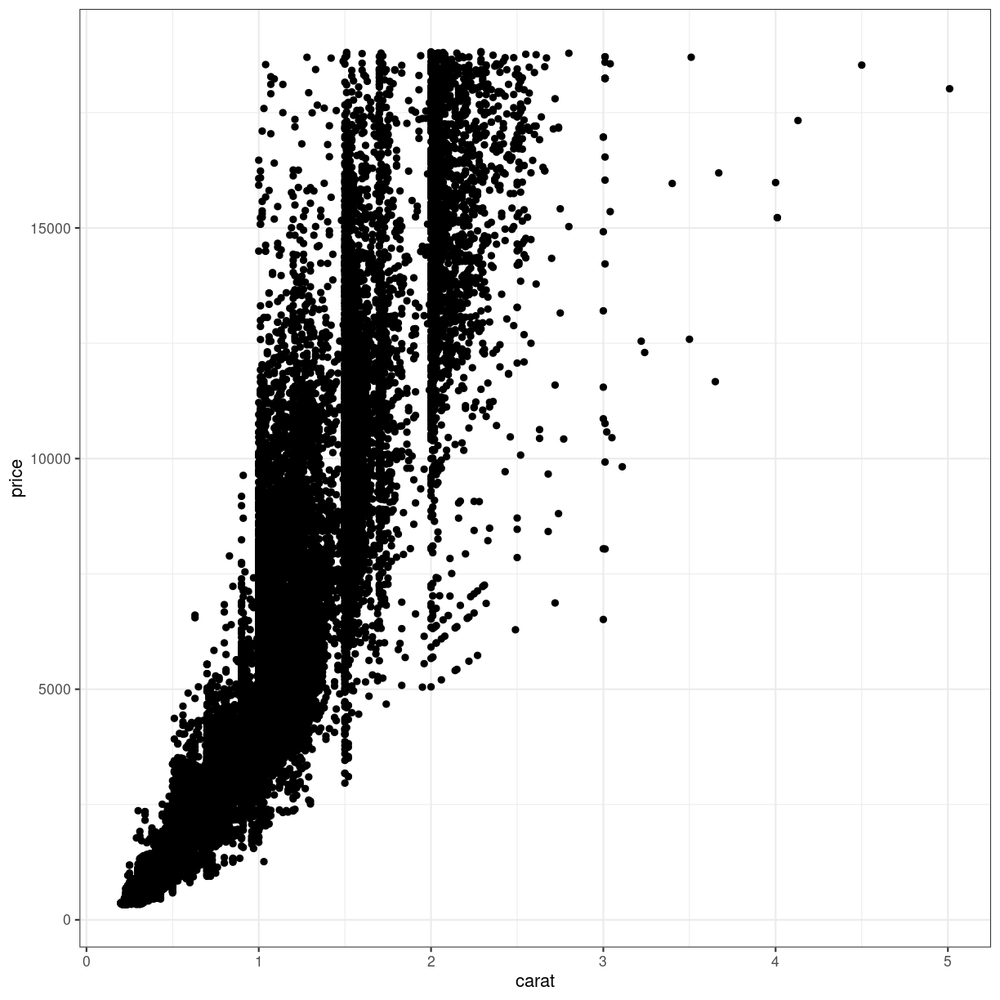
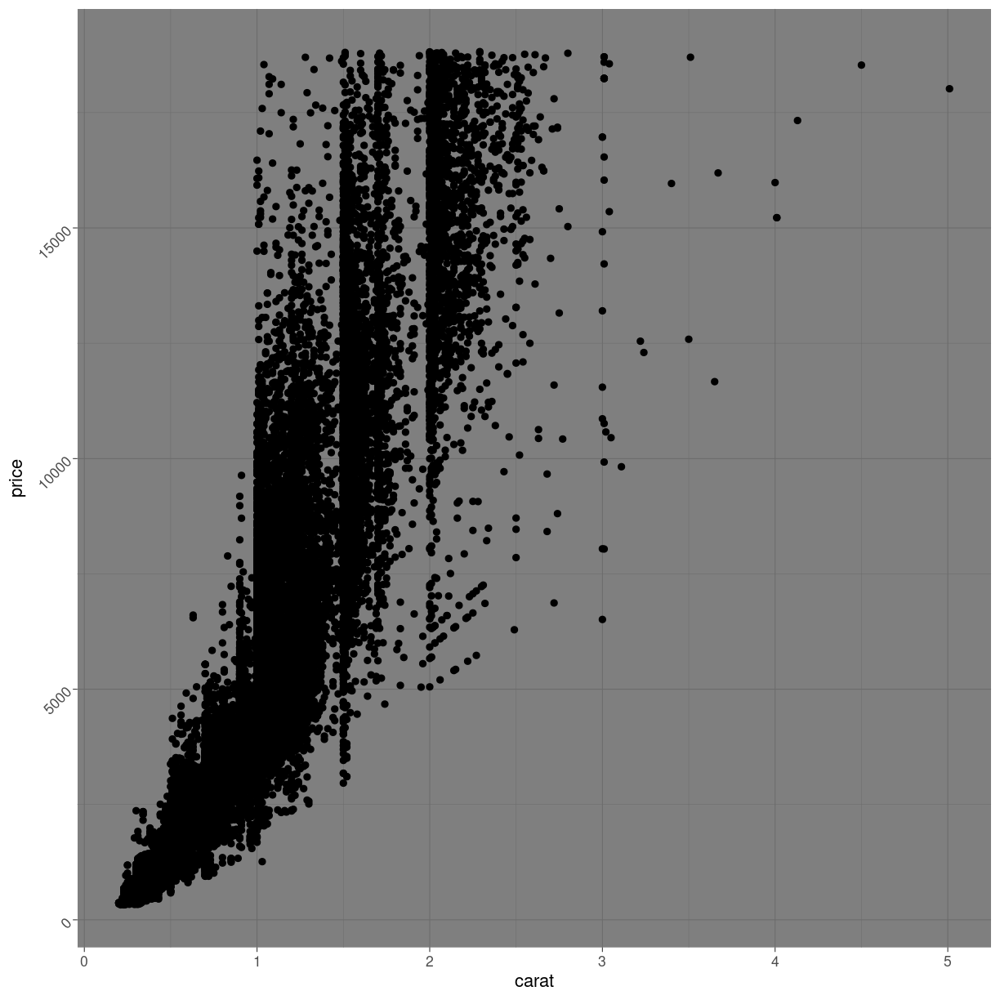

---
# Please do not edit this file directly; it is auto generated.
# Instead, please edit 06-theming.md in _episodes_rmd/
title: "Theming"
teaching: 10
exercises: 5
questions:
- "FIX ME"
objectives:
- "FIX ME"
keypoints:
- "FIX ME"

source: Rmd
---

### THEME_FUNCTION

Every part of the plot can be changed. The grey background might be annoying
The gridlines might be confusing.

These non-data components of the plots can be controlled using the family of `theme`
functions:

~~~
ggplot(diamonds, aes(carat, price)) +
  geom_point() +
  theme_bw()
~~~
{: .language-r}

More exists:

~~~
Error in default | bw: operations are possible only for numeric, logical or complex types
~~~
{: .error}

> ## Notice the pattern?
>
> A general pattern of function names in ggplot2 can be seen.
>
> Themes are named "theme_" and then the name of the theme. We saw the
> same pattern with the scale functions: "scale_" and then the axis, followed
> by what we did to the axis, eg: "scale_y_log10"
>
{.callout}

### Even more theming

*Every* element in the plot can be controlled. The `theme()`  function is the
way to do that:

~~~
diamonds %>% 
  ggplot(aes(carat, price)) +
  geom_point() +
  theme_dark() +
  theme(axis.text.y = element_text(angle= 45))
~~~
{: .language-r}

Angling the labels in a plot can be good for readability. However the actual
way to do it can be a bit more involved as you see above. Read the help for
theme to get at complete list of things that can be changed. There are 97 
things in total.

Also note, that we can add theming on top of previous theming. Here we begin
with a built-in theme that we like, and change the parts we want to change. 

Finally note, that the order is important:

~~~
diamonds %>% 
  ggplot(aes(carat, price)) +
  geom_point() +
  theme_dark() +
  theme(axis.text.y = element_text(angle= 45))
~~~
{: .language-r}
and 

~~~
diamonds %>% 
  ggplot(aes(carat, price)) +
  geom_point() +
  theme(axis.text.y = element_text(angle= 45)) +
  theme_dark() 
~~~
{: .language-r}

Will not give the same result. `theme_dark` has a setting for the way the text
on the y-axis is shown, and will overwrite the changes done before calling it.


