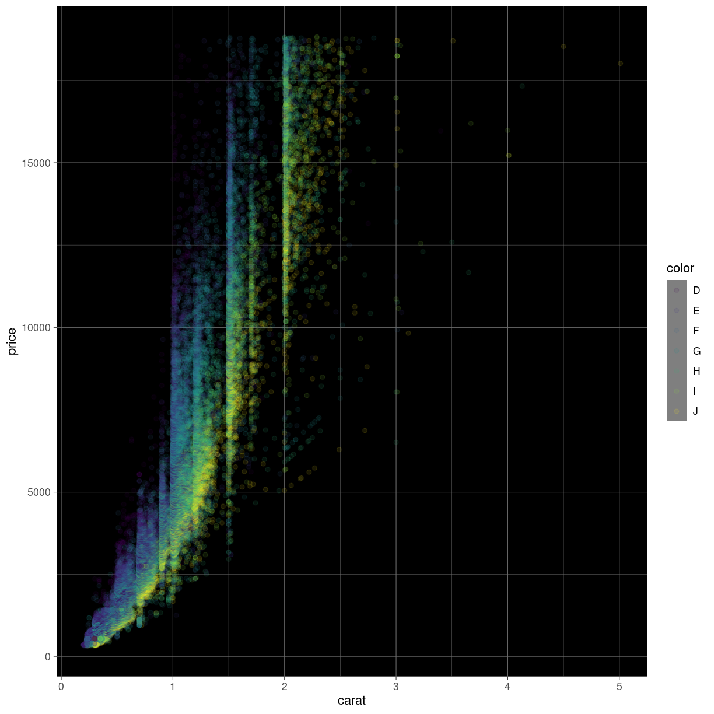

---
# Please do not edit this file directly; it is auto generated.
# Instead, please edit 08-saving.md in _episodes_rmd/
title: "Saving and exporting"
teaching: 10
exercises: 5
questions:
- "FIX ME"
objectives:
- "FIX ME"
keypoints:
- "FIX ME"

source: Rmd
---

saving private ggplot

## It would be nice to be able to save the plot.

både som sidste plot. brug plotte panelet i rstudio til at justere.

Men også muligt at bestemme størrelse direkte.

Forskellige filformater.
hvad er godt til hvad.

~~~
diamonds %>% 
  ggplot(aes(carat, price)) +
  geom_point()
~~~
{: .language-r}

~~~
ggsave()
~~~
{: .language-r}

~~~
Error in ggsave(): argument "filename" is missing, with no default
~~~
{: .error}

~~~
ggplot(data = diamonds, mapping = aes(x = carat, y = price, color = color)) +
  geom_point(alpha = 0.1) +
  theme_dark() +
  theme(panel.background = element_rect(fill = "black"))
~~~
{: .language-r}

saving plottet.


