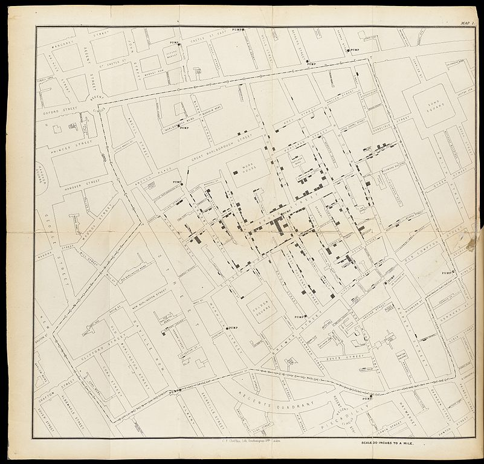

```{r, include = FALSE}
source("../bin/chunk-options.R")
knitr_fig_path("00-")
```

```{r setup, include=FALSE}
knitr::opts_chunk$set(echo = TRUE)
library(tidyverse)
```

## Why even visualise data?

Data can be complex. Data can be confusing. And a good visualisation of data
can reduce some of that complexity and confusion.

A good visualisation can reveal patterns in our data.

A really good visualisation can even provide insight that is difficult, or
impossible to find without.

A good example is this map, where the English physician John Snow plotted the 
deaths from Cholera in Soho, London from 19th august to 30th September 1854. 




The concentration of deaths indicated that the source of the disease was a 
common water pump. Removing the handle from the pump brought an end to the 
outbreak.

We are probably not going to discover patterns of equal importance in this course.


## The dataset we are working with

We are going to study a dataset containing information on prices and other attributes
of 53940 diamonds. The dataset is included in the `ggplot2` package, that we
installed as part of `tidyverse`

```{r}
library(tidyverse)
head(diamonds)

```

There are 10 variables in the dataset:

| Variable | What is it? |
|----------|-------------|
| carat    | Weight of the diamond in carat (0.200 gram) |
| cut      | Quality of the cut of the diamond (Fair, Good, Very Good, Premium, Ideal) | 
| color    | Color of the diamond from D (best), to J (worst) |
| clarity  | How clear is the diamond. I1 (worst), SI2, SI1, VS2, VS1, VVS2, VVS1, IF (best) |
| depth    | Total depth percentage = z / mean(x, y) |
| table    | Width of the top of the diamond relative to its widest point |
| price    | Price in US dollars |
| x        | Length in mm | 
| y        | Width in mm |
| z        | depth in mm |

Slightly more detailed information can be found in the help for the dataset:
```{r eval =F}
?diamonds
```


