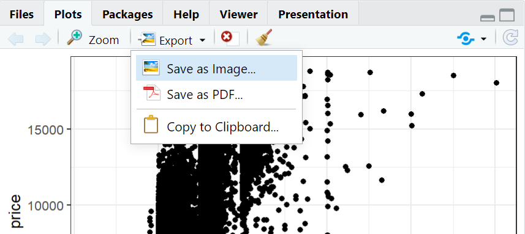
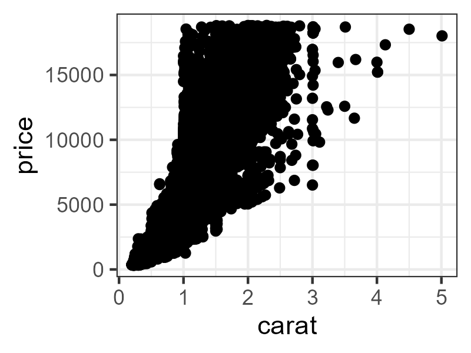

saving private ggplot
```{r, include = FALSE}
source("../bin/chunk-options.R")
knitr_fig_path("08-")
```

```{r setup, include=FALSE}
knitr::opts_chunk$set(echo = TRUE)
library(tidyverse)
```


## It would be nice to be able to save the plot.

Saving a plot can be done directly from the plot pane in
RStudio



ggplot2 also includes a function for saving the last plot
you made. This function will save it as "myimage.png" in your
current directory. The image will be 800x600 pixels (px) in size, and with a resolution of 300 dpi.
```{r eval = F}
ggsave("myimage.png", width = 800, 
       height = 600, units = "px",
       dpi = 300)
```

However, this does not look very nice:

The points are too big for the plot!

Be prepared for a lot of fiddling about with your plots if
you want to use `ggsave()`. 

Adjusting size, and getting af nice image is often easier 
adjusting the size of the plot pane directly in RStudio. 

The saved image will reflect what you see on the screen.

## There is more than JPG and PNG in the world!
JPG is a popular format for saving images. It produces nice,
small files. PNG is also a popular format for images.

By default, ggsave is able to recognize the extension you
give your file name (.png in the example above), and save 
to these formats:

* eps
* ps
* tex
* pdf
* jpeg/jpg
* tiff
* png
* bmp
* svg
* wmf (only on windows)



